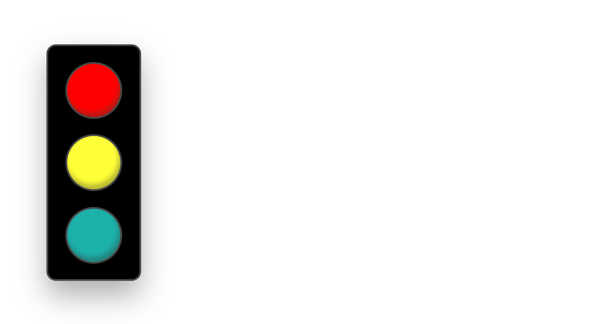

# React.js Traffic Light

This project is completed as part of the technical interview for an application to [Uptrust](https://uptrust.co/) for apprenticeship. Uptrust builds software to help people navigate and successfully exit the criminal justice system. To date, it has helped over 150,000 people avoid jail time. Its client-centered approach provides jurisdictions with a win-win-win: better client outcomes, happier staff and huge cost savings.

## About the Project



This project was created using [Create React App](https://github.com/facebook/create-react-app). The App incorporates a couple of components that render the traffic lights inside a light box.

The `TrafficLight` component, reused for all three lights, renders according to two properties: a boolean value which indicates if the particular light is turned on, and the other, string property gives the color which will be used to style the color should the light be turned on. The component renders conditionally and adds light color or renders the default color based on the boolean value property.

The `TrafficLightBox` component houses the three `TrafficLight` components and maintains the state for the lights in an object containing boolean values each of which assigned to one of the three lights. The component also uses a `useCallback` hook for a light-switching function, which is included as a dependent in a `useEffect` hook and called when the App mounts and when the function calls itself before completing each iteration of switching the lights from red to green to yellow back to red.

The `App` component is a skeleton which returns the `TrafficLightBox` component.

## Getting Started

To get a local copy up and running follow these steps:

### Prerequisites

This project does not require a server, but does requrie you to have Node.js and NPM installed on your computer to run the App. You can download the latest LTS version of, as well as the most up-to-date, Node.js and the companion version of NPM [here](https://nodejs.org/en/download/) for most of the platforms.

### Installation

1. Clone the repo using HTTPS or SSH:

```
git clone https://github.com/Sanlung/uptrust-interview.git
```

or

```
git clone git@github.com:Sanlung/uptrust-interview.git
```

2. In the project directory, install necessary dependencies via NPM:

```
cd uptrust-interview
npm install
```

It takes a short while for NPM to complete installing the dependencies.

### Run the App

Run the app after the dependencies are installed:

```
npm start
```

## Contact

Author: Chung Kao

Project Link: https://github.com/Sanlung/uptrust-interiew
